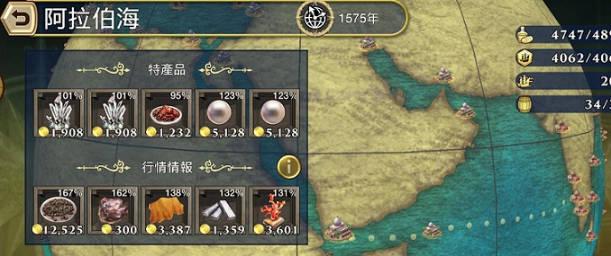
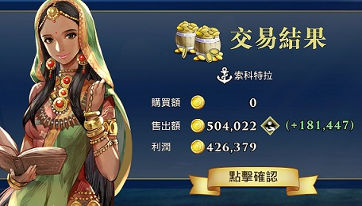
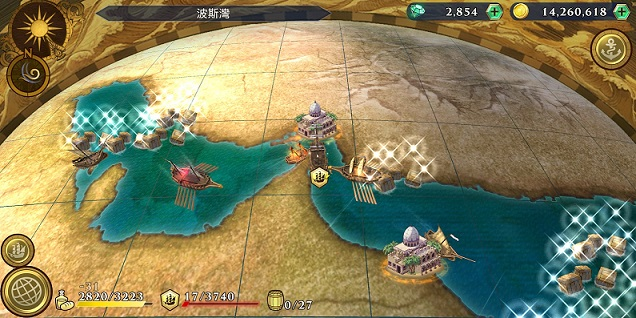
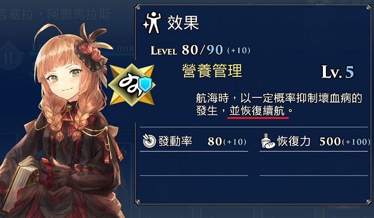
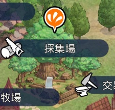
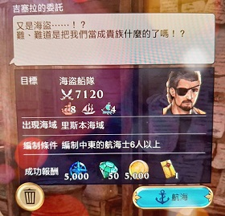
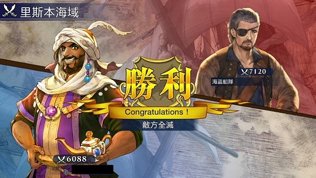
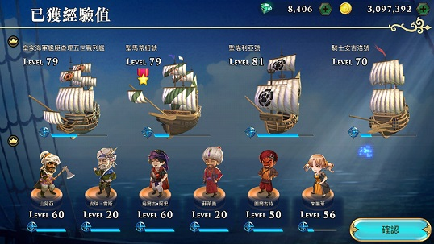
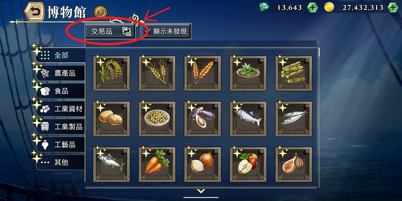

這是新手向的大航海時代 VI 筆記，純粹心得之談，故必然存在一定主觀性。本筆記具指導性，因此簡單如遊戲基本操作在此不提。

歡迎到本會 - **香港天星碼頭** 討論: <a href="https://t.me/HKStarFerryPier">https://t.me/HKStarFerryPier</a>

另外特別介紹本人製作的[造船計算機](https://avin-shum.github.io/uw6-ship-builder/)。注意：這個並非新手向的工具，建議找資深玩家請教用法。

(暫時未完成，會持續更新)

## 目錄

1. [賺錢篇](#1-賺錢篇)
2. [投資篇](#2-投資篇)
   1. [練法](#21-練法)
3. [戰船篇](#3-戰船篇)
4. [商船篇](#4-商船篇)
5. [銀與銅篇](#5-銀與銅篇)
   1. [船](#51-船)
   2. [航海士](#52-航海士)
6. [造船篇](#6-造船篇)
   1. [戰船](#61-戰船)
   2. [商船](#62-商船)
7. [練功篇](#7-練功篇)
8. [玩家升級篇](#8-玩家升級篇)
9. [每日任務篇](#9-每日任務篇)
10. [劇情篇](#10-劇情篇)
    1. [主線劇情(海戰)](#101-主線劇情海戰)
    2. [列傳](#102-列傳)

### 進階篇

{: .alpha-list}

1. [小帳篇](#a-小帳篇)
   1. [小帳的種類](#a1-小帳的種類)
   2. [交易細節](#a2-交易細節)
   3. [新帳號交易品需求](#a3-新帳號交易品需求)
2. [小技巧篇](#b-小技巧篇)
   1. [到市場找指定物品](#b1-到市場找指定物品)
   2. [快餓死了怎麼辦](#b2-快餓死了怎麼辦)

## 1. 賺錢篇

賺錢特別推薦跑**胡椒**路線

- 古晉 > 亞齊 > 卡利卡特 > 印度對面的六個中東港之一。

{: .center}

因為**中東**胡椒的[基準價(100%)](https://twitter.com/filippa_d5/status/1263352437164793857?s=20)比**印度**和**東南亞**高很多，所以賺錢很容易。一般只要價位在 110%以上就有不錯的利潤。有時可到 140%甚至 180%以上，配合枱價角一程大約 10 萬至 30 萬左右。而且可以滿足 2 個每日任務的需求。

建議倉位: 基本 23 倉 = 3 個港口的胡椒總和，考慮到深交術的影響建議 32 以上。

貨船推介:

- 亞哈爾號: 提高抬價機率，多賺一點錢。而且是銀船，很容易就造滿。缺點是倉位只有 C8。
- 救濟者號: 配**瑪麗亞姆**，可以多買一點胡椒。缺點是不能造出，入手要講綠分。
- 伊納濫號: 東南亞交易船。缺點是東南亞補貨角只有白色情人節的阿南塔猜，不容易入手，而且船本身是彩船，較難造出。

船員推介:

- 抬價角: 賈姆希德，里拉 (新!)，圖爾古特
- 補貨角: 瑪麗亞姆，披蓮通泰普善佩 (新!)，阿南塔猜(白色情人節)

{: .center}

{: .right-text }
[↑ 返回目錄](#目錄)

## 2. 投資篇

投資主要的重要性在於能得到一些重要的物品來造船。

由於投資到 Lv5 需時可能會很長，對新手來說最好重點投資，以下是一些建議的投資航線:

| 航線      | 投資港口                          | 目標物                                           |
| --------- | --------------------------------- | ------------------------------------------------ |
| 西歐線    | 倫敦 - 南特                       | 金屬盔甲、夏洛特蛋糕                             |
| 南歐線 I  | 里斯本 - 塞維爾 - 休達            | 葡萄牙櫃櫥、銀線金製工藝品、小型高頂盔、壼型頭盔 |
| 南歐線 II | 威尼斯 - 拉古薩                   | 威尼斯玻璃、青銅像                               |
| 中東      | 特拉布宗 - 奧德薩                 | 科拉津鎧甲、彎刀                                 |
| 印度      | 果阿 - 門格洛爾                   | 雞肉派、莫臥兒甲冑                               |
| 東南亞    | 丹老 - 嘉定                       | 緬刀、香蕉蛋糕                                   |
| 明朝      | 福州 - 武昌                       | 茶葉、明朝鎧甲、杏仁豆腐                         |
| 北歐      | 奧斯陸 - 但澤 - 里加 - 斯德哥爾摩 | 鮭魚                                             |

- 南歐**巴賽隆納**Lv3 有**鋼**，也是很重要的物品，可以看情況配入南歐線 I 或 II。

### 2.1 練法

- 心訣: **9 買 9 賣**。即在 A 港全數買入，然後到 B 港全數賣出，賺蝕不是重點(投資嘛)，重要的是用最短時間投資。
  - 由於*北歐線*商品同質性太高，可以考慮把途中的港口都投資一下。
- 船: 當然以具備**投資訓練室**的船隻為佳。4 艘投資船就需要有 4 個相應文化圈的航海士來發動技能了。由於只需要保留一個港口的貨物，總倉位 20 出頭已經足夠了。
- 航海士: 首先是具備補貨技能(例如深交術)的角色，然後是有投資術的角色。當然，能利用投資船的角色也應該要有的。

_特別注意北歐地區有極多浮冰_，強烈建議使用能防浮冰的船(如羅斯托克號)和航海士(如迪奧)，通常各 1 已經夠了，等級不夠可能要再補一、兩個。

{: .right-text }
[↑ 返回目錄](#目錄)

## 3. 戰船篇

其實對於資深玩家來說沒有甚麼特別好對討論的。所謂*武無第二*，會被集中討論的戰船通常就那麼幾艘，寫在這裏給新手參考，就不多做分析了。

排名按本人喜好:

- 金鹿號 (極難造出)
- 皇家海軍艦艇查理五世戰列艦
- 皇家海軍艦艇無雙號
- 聖馬蒂紐號
- 聖喵利亞號 (不能造出)
- 騎士安吉洛號
- 英雄號

{: .right-text }
[↑ 返回目錄](#目錄)

## 4. 商船篇

商船的重要性就在於載貨量/倉位，船隊到了一定程度再看技能。對於新手來說即使銀/銅船也有很多好用的選擇，詳細可以看[銀與銅篇](#5-銀與銅篇)。

以下重點介紹部份彩與金的商用船*(技能不一定是商用技能)*:

- 以下只列出能造出的船隻。

| 船名             | 文化圈 | 稀有度 | 倉位    | 註解                                                                                                    |
| ---------------- | ------ | ------ | ------- | ------------------------------------------------------------------------------------------------------- |
| 奧廖爾號         | 西歐   | IV     | A12     | 高倉近戰船(但造船是用探材)，入手難度偏高                                                                |
| 維多利亞號       | 南歐   | IV     | A12     | 高倉探險船，入手難度偏高，也是頂級探險船，值得注意一下                                                  |
| 聖瑪利亞號       | 南歐   | III    | B10     | 遠洋適應性                                                                                              |
| **艾卜哈號**     | 中東   | IV     | **S15** | 遠洋適應性，神級商船                                                                                    |
| **阿克希薩爾號** | 中東   | III    | **S14** | 投資訓練室，神級商船                                                                                    |
| **光輝號**       | 中東   | III    | A13     | 耐熱甲板，需活動船材，較難造出。配合[彩米雷耶](https://game8.jp/daikoukaijidai6/314695)最高可達**16**倉 |
| 海洋號           | 印度   | III    | A12     | 遠洋適應性                                                                                              |
| 稀有號           | 印度   | III    | **S14** | 投資訓練室                                                                                              |
| 達圖西卡圖納號   | 東南亞 | IV     | **S14** | 高倉戰船(但造船是用商材)，入手難度偏高                                                                  |
| 伊納濫號         | 東南亞 | IV     | A12     | 交易訓練室，入手難度偏高                                                                                |
| **商人號**       | 東南亞 | III    | **S15** | 耐熱甲板，金船有 S15 倉，非常親民                                                                       |
| 文昌號           | 明朝   | III    | **S14** | 交易訓練室                                                                                              |
| 三國丸           | 日本   | IV     | **S15** | 交易訓練室，可惜現在的版本(2020 年 5 月)素材選擇有限，很不容易造出                                      |

{: .right-text }
[↑ 返回目錄](#目錄)

## 5. 銀與銅篇

我把本篇放在造船篇前，雖然新手可能會很想有新/高級船而想馬上造點船，但做船之前不妨先了解一下應該要造甚麼船。

本篇論述遊戲中銀和銅級的船和航海士。有些玩家很直觀地就覺得銀和銅級的就沒有價值，本篇就是要為他們平反的。

- 銀與銅的優點
  - 入手比較容易，初期能快速升級。尤其是彩金探險角因為資源問題很可能會卡在 R5 很長時間，隊伍的探險值可能需要銀銅角來支撐一段時間。
  - 幾乎都可以免費得到
  - 部份在個別領域能獨當一面(屬性 A 或以上、或者具備獨門/稀有技能)
- 銀與銅的缺點
  - (航海士)後期所需的重覆角色頗多，導致後期升級速度變慢
  - (航海士)在交換所/(金色的)契約書的影響下，升級可能比重點金角還要慢

### 5.1 船

- 船的資料可以在[造船計算機](https://avin-shum.github.io/uw6-ship-builder/)內按船的名稱找到。
- 這裏只列出能造出的船隻。

這樣數下來有 A/S 倉的船已經夠組一隊商船隊了，而且技能也很好用的。

注意: 以下船種是以船技能分類，和造船所需素材無關。

#### 戰船

| 船名                           | 文化圈 | 稀有度 | 註解                                                 |
| ------------------------------ | ------ | ------ | ---------------------------------------------------- |
| 聖路易號                       | 西歐   | II     | 櫃雞配方副產品，性能良好，但容易被取代，有點慢       |
| 法國皇家&#x200b;加萊塞排槳帆船 | 西歐   | II     | 人稱法排，除了皮薄沒有缺點，雖然皮薄也很致命……       |
| 騎士安吉洛號                   | 南歐   | II     | 櫃雞配方副產品，性能良好，可以用很久                 |
| 西梵什號                       | 印度   | II     | 數值不錯的戰船，可惜能配合的船員幾乎沒有             |
| 丁先皇號                       | 東南亞 | II     | 數值不錯的戰船                                       |
| 平靜之海號                     | 東南亞 | I      | 數值不錯的戰船，但有點慢                             |
| 海豹號                         | 明朝   | I      | 數值不錯的戰船，但都來到明朝了，恐怕沒有上場的機會了 |

#### 商船

| 船名       | 文化圈 | 稀有度 | 註解                                               |
| ---------- | ------ | ------ | -------------------------------------------------- |
| 虎尾草號   | 西歐   | I      | A 倉，A 續航，有遠洋適應性，可以一直用下去的船     |
| 羅斯托克號 | 西歐   | I      | A 倉，A 續航，有耐冰裝甲，開發北歐地區必備         |
| 永恆君主號 | 南歐   | I      | A 續航，有遠洋適應性，美中不足是只有 C 倉          |
| 亞哈爾號   | 中東   | II     | 有交易訓練室，賣胡椒好用，美中不足是只有 C 倉      |
| 活力者號   | 印度   | II     | A 倉，有耐熱甲板                                   |
| 貿易風號   | 東南亞 | II     | S 倉，有遠洋適應性，可以一直用下去的船             |
| 航行無礙號 | 東南亞 | II     | A 倉                                               |
| 海陽號     | 明朝   | I      | A 倉，有海底地形圖，可以長期留在東南亞至東亞的區域 |
| 長春丸     | 日本   | II     | B 倉，有投資訓練室                                 |
| 航海丸     | 日本   | I      | 有遠洋適應性，美中不足是只有 C 倉                  |

#### 探險船

| 船名         | 文化圈 | 稀有度 | 註解                                                                            |
| ------------ | ------ | ------ | ------------------------------------------------------------------------------- |
| 亞歷杭德拉號 | 南歐   | I      | A 續航，有體力訓練室，南歐強力探險隊員很多，可以加強戰鬥力，美中不足是只有 C 倉 |
| 拉羅薩號     | 中東   | II     | 具備戰船質素的探險船，技能對於中東探險隊員也很有用                              |
| 優雅號       | 印度   | I      | 有肉搏訓練室，印度探險隊員用，缺點是船的數值太差                                |

\* 以現在的版本(2020 年 5 月)來說朝鮮沒有甚麼特別出色的銀銅船。

### 5.2 航海士

{: .red}
(29/5/2020 加入最近系統大量加入的新角)

- 這裏只列出能免費獲得的航海士。
- 部份建議重點培養的名字**以粗體顯示**。
- 商用航海士通常是看 Rank，Lv 相對不重要。
- 現在的版本(2020 年 5 月) 朝日航海士不多，先跳過。

#### 銀

| 名稱                                                           | 文化圈 | 得意領域         | 註解                                                                                                     |
| -------------------------------------------------------------- | ------ | ---------------- | -------------------------------------------------------------------------------------------------------- |
| **伊琳娜‧席爾瓦**                                              | 南歐   | 海戰、投資       | 南歐圈投資術 (最高 Lv4)，海戰 A，水上的射法 (最高 Lv4)，海戰神技，配合連擊技能(如格拉特)，能打出大量傷害 |
| **吉塞拉‧阿爾馬拉斯**                                          | 南歐   | 航海、練功、海戰 | 著名的放火妹，強化後出航海神技，可以長時間不靠港，釣火船練功重要角色                                     |
| **米開朗基羅‧博納羅蒂**                                        | 南歐   | 航海             | 驅逐老鼠 (最高 Lv5)，老鼠王                                                                              |
| **山努亞‧阿薩姆**                                              | 中東   | 海戰、探險       | 海戰 B，接舷強攻 (最高 Lv4)，近戰高手，探險也有 A                                                        |
| **烏爾古‧阿里**                                                | 中東   | 海戰             | 猛擊的號令 (最高 Lv5)，近戰高手，還有船隻整備經驗                                                        |
| **朱麗葉‧貢扎加**                                              | 中東   | 採購             | 中東圈深交術 (最高 Lv5)                                                                                  |
| **瑪麗亞姆‧薩曼尼**                                            | 印度   | 採購             | 印度圈深交術 (最高 Lv5)，胡椒商隊主力成員                                                                |
| **瑪麗亞‧戈賓蒂**                                              | 印度   | 航海、探險       | 探險 A，全力勇進 (最高 Lv5)、 灼熱對策 (最高 Lv2)，很優秀的探險員，灼熱對策對前期開荒很重要              |
| **戴維‧巴尤**                                                  | 東南亞 | 探險             | 探險 S，夾擊陣形 (最高 Lv5)，還有火焰彈傍身                                                              |
| **凱魯‧伊斯梅爾**                                              | 東南亞 | 抬價             | 東南圈交涉術 (最高 Lv4)                                                                                  |
| **披蓮通泰普善佩** (新!) | 東南亞 | 採購             | 東南圈深交術 (最高 Lv5)                                                                                  |
| 克萊赫‧斯隆                                                    | 西歐   | 投資             | 西歐圈投資術 (最高 Lv4)                                                                                  |
| 羅克‧阿勒姆克                                                  | 南歐   | 海戰             | 海戰 A，火焰彈 (最高 Lv3)，前期主要紅炮手                                                                |
| 盧西奧‧塔瓦雷斯                                                | 南歐   | 探險             | 海戰 C，貫通彈 (最高 Lv2)，探險 A，先發一擊 (最高 Lv4)，然而最大問題是要二等藝術品書，難養               |
| 瑪路吉‧本斯里 (新!)      | 印度   | 海戰             | 海戰 A，葡萄彈 (最高 Lv4)                                                                                |
| 阿帕‧卡普爾 (新!)        | 印度   | 生產             | 牧場生產術 (最高 Lv4)，牧場就是他的了                                                                    |
| 蘇拉固耶恩                                                     | 東南亞 | 海戰、投資       | 海戰 A，破碎彈 (最高 Lv4)、東南圈投資術 (最高 Lv2)                                                       |
| 拉賈‧蘇萊曼                                                    | 東南亞 | 海戰             | 海戰 B，精準射擊 (最高 Lv4)                                                                              |
| 鄭松                                                           | 東南亞 | 投資             | 東南圈投資術 (最高 Lv4)                                                                                  |
| 多明戈斯‧德‧塞夏斯 (新!) | 東南亞 | 生產、海戰       | 礦山生產術 (最高 Lv3)，新一代礦工，海戰也有 A，技能也不錯                                                |
| 蓋洛特‧佩雷拉 (新!)      | 東南亞 | 海戰             | 海戰 A，火焰彈 (最高 Lv5)，強力炮手                                                                      |
| 伊迪‧奎尼                                                      | 異文化 | 海戰             | 海戰 B，火焰彈 (最高 Lv3)                                                                                |

#### 銅

| 名稱                                                               | 文化圈 | 得意領域   | 註解                                                                                          |
| ------------------------------------------------------------------ | ------ | ---------- | --------------------------------------------------------------------------------------------- |
| **迪歐‧霍夫曼**                                                    | 西歐   | 航海       | 極海航行術 (最高 Lv4)，北歐有他和羅斯托克號就不怕浮冰了                                       |
| **萊拉‧埃爾‧瓦贊**                                                 | 西歐   | 探購       | 異文化深交術 (最高 Lv5)                                                                       |
| **朱利奧‧阿布瑞尤**                                                | 南歐   | 探險、海戰 | 探險 B，先發一擊 (最高 Lv4)，前期可以撐高探險戰力，還有葡萄彈傍身                             |
| **喬爾喬‧瓦薩里** (新!)      | 南歐   | 抬價       | 啫好品售賣術 (最高 Lv4)，商益戰強力角色                                                       |
| **里奧‧亞非利加努**                                                | 中東   | 探險       | 供水 (最高 Lv5)，探險值高，還能當奶媽，還會抓老鼠                                             |
| **賈姆希德‧阿瑪迪**                                                | 中東   | 抬價       | 中東圈交涉術 (最高 Lv4)，首席胡椒推銷員                                                       |
| **瓦菲婭‧哈基姆** (新!)      | 中東   | 海戰       | 海戰 B，接舷強攻 (最高 Lv4)，中東又一近戰高手                                                 |
| **佩羅‧艾斯特維茲** (新!)    | 印度   | 抬價       | 印歐航路交涉術 (最高 Lv3)，少有的印度抬價角                                                   |
| **蘇漢迪‧拉希德**                                                  | 東南亞 | 探險       | 探險 A，防備陣形 (最高 Lv5)                                                                   |
| **黃秋英**                                                         | 東南亞 | 海戰       | 海戰 A，接舷強攻 (最高 Lv5)，一流近戰成員                                                     |
| **露西婭‧德‧索薩**                                                 | 東南亞 | 海戰       | 海戰 B，連鎖彈 (最高 Lv4)，少有的黃炮手                                                       |
| **里拉‧阿爾巴** (新!)        | 東南亞 | 抬價       | 農產品售賣術 (最高 Lv4)，新一代胡椒推銷員                                                     |
| **張梅花** (新!)             | 東南亞 | 抬價       | 東南圈交涉術 (最高 Lv4)，銅版凱魯，多一隻就多一份力量                                         |
| **恩金格‧恩本巴** (新!)      | 異文化 | 採購       | 南歐圈深交術 (最高 Lv5)                                                                       |
| **埃塞爾‧費雷** (新!)        | 異文化 | 抬價       | 異文化交涉術 (最高 Lv5)，雖然暫時商益戰還沒有包括異文化圈……                                   |
| 胡安‧何塞                                                          | 西歐   | 海戰       | 海戰 A，破碎彈 (最高 Lv4)，西歐炮手(雖然是西班牙人)，前期角色不多時也很好用                   |
| 魯利‧比安可 (新!)            | 南歐   | 投資       | 南歐圈投資術 (最高 Lv5)                                                                       |
| 帕爾加勒‧帕夏                                                      | 中東   | 投資       | 中東圈投資術 (最高 Lv4)                                                                       |
| 埃莎‧嘉拉特納                                                      | 印度   | 航海       | 灼熱對策 (最高 Lv4)                                                                           |
| 名謢思戶                                                           | 異文化 | 海戰       | 海戰 B，葡萄彈 (最高 Lv4)                                                                     |
| 阿蒙迪‧卡爾梅                                                      | 異文化 | 投資       | 異文化投資術 (最高 Lv2)，非洲投資就靠她了                                                     |
| 艾哈邁德‧亞伯拉罕‧加齊 (新!) | 異文化 | 海戰       | 海戰 S，沉船一擊 (最高 Lv5)，強力炮手，可惜是異文化人                                         |
| 紐塔 (新!)                   | 異文化 | 探險       | 探險 A，心理戰術 (最高 Lv4)，前期可以撐高探險戰力，降攻令隊員有更多輸出的機會，可惜技能吃距離 |

{: .right-text }
[↑ 返回目錄](#目錄)

## 6. 造船篇

造船的話不得不提[造船計算機](https://avin-shum.github.io/uw6-ship-builder/)。然而對新人來說跟別人的配方可能更重要，以下是一些常見的配方：

### 6.1 戰船

| 配方                                                                                                                                                                                                                                                                                                                                                               | 註解　                                                                                                                                                                                                                       |
| ------------------------------------------------------------------------------------------------------------------------------------------------------------------------------------------------------------------------------------------------------------------------------------------------------------------------------------------------------------------ | ---------------------------------------------------------------------------------------------------------------------------------------------------------------------------------------------------------------------------- |
| [鋼 鋼 鋼 葡萄牙櫃櫥 雞肉派](https://avin-shum.github.io/uw6-ship-builder/?%E5%85%A7%E8%A3%9D=%E8%91%A1%E8%90%84%E7%89%99%E6%AB%83%E6%AB%A5&%E5%BB%BA%E6%9D%901=%E9%8B%BC&%E5%BB%BA%E6%9D%902=%E9%8B%BC&%E5%BB%BA%E6%9D%903=%E9%8B%BC&%E6%94%AF%E6%8F%B4=%E9%9B%9E%E8%82%89%E6%B4%BE)                                                                              | 俗稱三鋼櫃雞、櫃雞、邪教，能涵蓋大部份常用的戰船，包括金鹿號。 而且材料都可以在商店買到。鋼可以換其他同級(如黃銅)或更高級(如防護壁)等素材。 如果換上三支大炮，理論上可以提高金鹿號的出貨率。                           |
| [鋼 鋼 鋼 威尼斯玻璃 雞肉派](https://avin-shum.github.io/uw6-ship-builder/?%E5%85%A7%E8%A3%9D=%E5%A8%81%E5%B0%BC%E6%96%AF%E7%8E%BB%E7%92%83&%E5%BB%BA%E6%9D%901=%E9%8B%BC&%E5%BB%BA%E6%9D%902=%E9%8B%BC&%E5%BB%BA%E6%9D%903=%E9%8B%BC&%E6%94%AF%E6%8F%B4=%E9%9B%9E%E8%82%89%E6%B4%BE)                                                                              | 櫃雞下位版，適合還未解鎖葡萄牙櫃櫥的玩家，但不建議放比黃銅以上的素材，因為性價比較低。 如果還未解鎖印度的話雞肉批可以考慮暫時用葡萄酒頂替。                                                                               |
| [特製大炮 特製大炮 撞角 小型高頂盔 燻鮭魚](https://avin-shum.github.io/uw6-ship-builder/?%E5%85%A7%E8%A3%9D=%E5%B0%8F%E5%9E%8B%E9%AB%98%E9%A0%82%E7%9B%94&%E5%BB%BA%E6%9D%901=%E7%89%B9%E8%A3%BD%E5%A4%A7%E7%A0%B2&%E5%BB%BA%E6%9D%902=%E7%89%B9%E8%A3%BD%E5%A4%A7%E7%A0%B2&%E5%BB%BA%E6%9D%903=%E6%92%9E%E8%A7%92&%E6%94%AF%E6%8F%B4=%E7%87%BB%E9%AE%AD%E9%AD%9A) | 無雙號和查理五世的配方。金彩率高。混配其他內裝可以出其他文化圈的戰船，變化頗多在此不贅。 _造燻鮭魚的配方要升爵位，等級要求是 52。_                                                                                        |
| [鋼 鋼 救生工具 小型高頂盔 燻鮭魚](https://avin-shum.github.io/uw6-ship-builder/?%E5%BB%BA%E6%9D%901=%E9%8B%BC&%E5%BB%BA%E6%9D%902=%E9%8B%BC&%E5%BB%BA%E6%9D%903=%E6%95%91%E7%94%9F%E7%94%A8%E5%85%B7&%E5%85%A7%E8%A3%9D=%E5%B0%8F%E5%9E%8B%E9%AB%98%E9%A0%82%E7%9B%94&%E6%94%AF%E6%8F%B4=%E7%87%BB%E9%AE%AD%E9%AD%9A)                                             | 造金鹿號的新邪教，玩家表示中獎機率比櫃雞邪教高。 其中一個鋼可以換防護壁令造出的彩船多 1 艘，或者換大炮多 2 艘。 圈圈可以換索具或者桅杆，如果換信號旗要留意點數，可能會少造 1 艘。 _燻鮭魚要升爵位，等級要求是 52。_ |

### 6.2 商船

商船配方可以參考[【大航海時代 VI】【新手向】前期造船暨發展指南](https://m.gamer.com.tw/forum/C.php?bsn=37032&snA=767&bpage=1&ltype=)。由於戰船對新手而言比較重要，造商船可以當作時消耗其他船材的副產品。當戰船造得差不多時，重心自然會轉向其他的船種了。

但是這裏特別要提一下，使用低價值(即價值低於 40000)的配方只是不得已而為之的做法。如果有能力配出 40000 或以上的配方的話，就應該用 40000 或以上的配方，即使你的目標只是稀有度低的船。如果你不是歐王的話，造滿稀有度高的船之前，稀有度低的船早就滿到不要不要了。

以下是相對高階的商船配方，主要難處在內裝品(左下)，如果市場有賣看個人能力也可以試試看。

| 配方                                                                                                                                                                                                                                                                                                                                         | 註解　                                                                                    |
| -------------------------------------------------------------------------------------------------------------------------------------------------------------------------------------------------------------------------------------------------------------------------------------------------------------------------------------------- | ----------------------------------------------------------------------------------------- |
| [保險櫃 皮革裝訂 裝飾秤 彎刀 香蕉蛋糕](https://avin-shum.github.io/uw6-ship-builder/?%E5%BB%BA%E6%9D%901=%E4%BF%9D%E9%9A%AA%E6%AB%83&%E5%BB%BA%E6%9D%902=%E7%9A%AE%E9%9D%A9%E8%A3%9D%E8%A8%82&%E5%BB%BA%E6%9D%903=%E8%A3%9D%E9%A3%BE%E7%A7%A4&%E5%85%A7%E8%A3%9D=%E5%BD%8E%E5%88%80&%E6%94%AF%E6%8F%B4=%E9%A6%99%E8%95%89%E8%9B%8B%E7%B3%95) | 涵蓋商船三大文化圈。如果出彩船也能出 5 艘。 **彎刀**可換**科拉津鎧甲**或**奇徹克盔**。 |

{: .right-text }
[↑ 返回目錄](#目錄)

## 7. 練功篇

- 說起練功首先要提一個新手常問的問題: **商船要打海盜練功嗎?**
  - 雖然商船戰鬥力未必高，感覺打海盜很無力，但是對商船/航海士，或者說非戰船/航海士，**升級最有效的手段除了吃道具，就是打海盜**，完。不要懷疑。
  - 而且練功可以委任練，練起來不會有被海盜虐的感覺。

---

- 解鎖印度前，新手練功可以解海戰任務，打火船的話可以到亞速爾或者黑海，就是追著火船委任打就可以了。_**船隊不要載貨，否則 99%判輸而且戰損超大**_

- 解鎖印度後，練功只介紹一個地方 - **荷姆茲**

{: .center}

好處:

- 有壞血(對老手來說)、無老鼠等減少船隊耐久的事件
- 訓練點就在港口外面
- 不用追火船
- 近母港(蘇拉特)

壞處:

- 有壞血(對新手來說)、有灼熱

要點:

- **空倉**
- 續航最好 2000 以上
- 戰力不重要，輸也有經驗，最重要是有恆心
- 不必追船，跑了就跑了
- **進化版放火妹**是神角，最好帶上 (參見[劇情篇-列傳](#102-列傳))
- 想練快一點的話可以在沒火船靠近時進港口補給洗掉畫面海上的船隻
- 想賺點航海士幣殘血時可以去撿寶箱，但要小心阿拉伯海有老鼠
- 全戰船上的話可能會有續航太低問題，可以順便混點商船，反正商船也需要練
- 而且部份商船有耐灼熱甲板或者遠洋適應性，可減低續航消耗

{: .center}

{: .center-text}
↑ 只要觸發技能(解壞血事件)，就可以回滿續航，爽歪歪。

{: .right-text }
[↑ 返回目錄](#目錄)

## 8. 玩家升級篇

遊戲內不少重要素材都需要透過加工所造出來，而加工配方又需要玩家升級(爵位才能得到)，比較有效率的升級方法有兩種:

- 完成劇情任務，包括主線和活動，而活動劇情任務可遇不可求，有得打要珍惜。
- 到其他玩家港口介面「協助」他們，按下有橙色圓點的建築物即可，按一次有機會得 5%經驗，很不錯，問題是這些機會不算很高……

{: .center}

{: .right-text }
[↑ 返回目錄](#目錄)

## 9. 每日任務篇

每日任務(課題)就是每天的功課，以下是一些如何快速完成每日任務的建議*(列出順序與遊戲不符)*:

- 取得 3 次海戰勝利
- 開鎖 3 個寶箱
  - 以上兩項可以在每天的競技場完成 (2v2 勝利/大混戰頭 3 名都算勝利，而且有戰利品箱送)。
  - 如果不能在競技場達成 3 勝，可以以完成海戰委託代替。
  - 或者到[荷姆茲罰站(練功)](#7-練功篇)也可以。
- 在港口出售 20 個交易品
- 在港口賺取 10,000 達克特
  - 這個[跑一趟胡椒](#1-賺錢篇)就可以了。還可以早一天把船停在中東港，第二天一賣出就達成了。
- 達成 5 個任務
  - 部份任務可以事前達成，早一天做好，不報告，第二天報告就可以了。
  - 早一天準備讓你可以選擇一些比較容易完成的任務，也可以透過委任省下了人手跑船的時間。
  - 主線劇情也算任務，所以新手要達成這個也不是難事。
- 在市場購買 1 次交易品
  - 沒甚麼技巧，進去買就對了。
- 完成所有每日課題
- 完成 4 個每日課題
  - 這兩個沒甚麼好說的了。

{: .right-text }
[↑ 返回目錄](#目錄)

## 10. 劇情篇

- 強烈建議參閱[【大航海時代 6~華勒斯懶人包】](https://wallacechen.pixnet.net/blog/post/228357491-%E3%80%90%E5%A4%A7%E8%88%AA%E6%B5%B7%E6%99%82%E4%BB%A36~%E8%8F%AF%E5%8B%92%E6%96%AF%E6%87%B6%E4%BA%BA%E5%8C%85%E3%80%91)，「主線任務」部份。
  - 裏面對於任務需求，尤其是所需交易品有清晰的描述，方便入貨時作出規劃。

### 10.1 主線劇情(海戰)

推主線最容易卡的就是海戰任務。主線任務最明顯的特點就是敵人數量很多，對上 12 隻甚至 16 隻也是等閒事，所以會有難度比任務顯示的戰力不符的情況*(雙拳難敵四手啊)*。

所以船隊裏最好有加防禦(通常是炮擊防禦)的角色，比較熱門的選擇是[彩多利亞](https://game8.jp/daikoukaijidai6/308519)和[戚繼光](https://game8.jp/daikoukaijidai6/281141)，這也是為甚麼很多人介紹首抽要有戚繼光的原因。

防技有效的時候，通常船隊都會很硬，可以在這個時候盡量輸出，但是有效時間一過就可能有危險了，有需要可以在這個時間繞圈等冷卻。另外如果打到後段已經有船數優勢的話，可以考慮繞圈鎖定勝局，避免最後翻船。

至於其他船員，一般都是炮戰角色為主，傷害大、範圍廣。近戰太弱勢，兩者都比不上炮戰，不知道甚麼時候才能翻身……

新手很容易會落入彩金情意結裏，雖然部份彩金角版面很漂亮，但是 R 不高的話，可能還不如高 Lv 的[銅角](#52-航海士)，卡關時不妨放手換換看看。

戰船的話，新手都不外乎三鋼櫃雞系的戰船，就不多解釋了。

另外，如果吃海戰道具就能過的話不妨全都吃，反正要打的海戰關卡相對於海戰道具的補給量而言不算多。

### 10.2 列傳

列傳現時為止比較麻煩的就是放火妹 - **吉塞拉‧阿爾馬拉斯**畢業的任務(6 個中東航海士打對手 **7120 戰力**)。可是放火妹進化版實在太有用，不能由它放著。以下是攻略要點。

{: .center}

{: .right-text .small}
(圖片來源: [巴哈哈啦版](https://m.gamer.com.tw/forum/C.php?bsn=37032&snA=718))

{: .center}

要點:

- 純中東航海士主打近戰，對以多欺少的 NPC(而且戰力還很高)非常不利。
- 對方會放**混亂**，可用**朱麗葉**解之。注意混亂時間內發動技能會增加冷卻時間，而且這個時間就算解了混亂也不會補回來的。所以要留心放技能的時間。
- 對方以炮擊為主，有加炮防的**海雷丁**和**蘇萊曼**就很重要了。
- 輸出主要靠**阿里**、**山努亞**、**瓦菲婭** (新!)之類的近戰角色，如果有幸抽到**彩哈桑**或者**金阿里**可以考慮改用炮攻。
- 老將**皮瑞‧雷斯**可以減防，可以幫助輸出。
- 之前沒有練中東船的話，用高等戰船可以了，白字的實力還是擺在那裏的。
- 如果母港不是里斯本的話建議委任過去，避免中途事件扣掉耐久。

{: .center}

{: .center-text}
↑ 雖然出門忘了帶海雷丁，但還算輕鬆。巴哈也有 5000 戰力過關的報告。

{: .right-text }
[↑ 返回目錄](#目錄)

# 進階篇

## A. 小帳篇

這裏我用「小帳」一詞而不是「替身」或者「分身」，因為這些帳號的用途只是輔助主帳，而不是玩家的另一個身份。

### A.1 小帳的種類

按小帳的使用方法，我分為兩類:

#### 母雞

- 負責持續地為主帳產生資源，就是能通過市場轉讓的，例如：
  - 製作加工品 (燻鮭魚、雪酪等需要長時間製作的物品)
  - 收集酒場資源
  - 收集活動資源
  - 生產某種母港特有的產品
  - 定期產出一等探險書
- 作為主帳的倉庫。
- 這種小帳要養，但請量力而為，而且不要忘記這是為了主帳而設的帳號，如果太花時間在小帳上就有點捨本逐末了。

#### 春雞

- 和母雞一樣能提供資源，但是只是一次性/短暫性的，資源是來自系統給新帳號的大量資源而來的。
- 建新帳號看起來很花時間(一般要 2 小時)，可是把那 2 小時用在主帳又能得到那些資源嗎？若果不能，那為何不建新帳號呢？
- 可以產生的資源例如：
  - 利用首抽/初期可得的*大量免費寶石*產生交易幣換探險書(尤其是一等探險書)
  - 完成活動所得的資源
- 通常這種小號只會養到 14 級(解鎖市場)為止。
  - 也就是說他們一般都會留在**阿姆斯特丹**。
- 提供完資源後可以算是沒有利用價值了，可以放棄或者等它們一個月沒登錄再回來拿回鍋特典……
- 有多餘錢(幾十萬左右)的話，也可以給他們在港口拆石頭換寶石。

---

### A.2 交易細節

多得 KT 的遊戲設計天才，令玩家之間的交易充滿**_挑戰性_**，只要有價值的東西放到市場上，很快就會有其他玩家買走了。

所以如果你要賣出物品給特別的對象的話，需要先和對方協議好，等對方進到自己港口介面才可以放售。而且交易品數量不能太多，數量一多交易時間一長，其他玩家就有時間進來搶了。

而大小帳交易的話，只用一個設備切換，登出登入的時間早已足夠被其他玩家收走了。所以大小帳必須以**兩部設備**(例如一部電話加一部 PC 模擬器)分開登入作實時交易才可。

#### 交易港口

要進入賣方的市場，需要用以下其中一種方法：

- 如果賣方和買方的母港一樣，買方只需要在自己市場找即可。
- 如果賣方和買方在同一公會，不論兩者母港是否相同，買方可經外交館進入賣方市場。
- 若以上兩者皆不符合，買方需派船隊到賣方母港進入市場。

由此得知，買賣雙方在同一公會的話，交易是最方便的。可是這麼一來道義上玩家對公會就有多一倍的責任了(如公會任務)。

如果有超過一個小帳而具中一個有相當練度的話(例如一隻母雞+N 隻春雞)，另一個做法是，具練度的小帳和主帳留在同一母港，而一眾小帳在同一公會，那麼春雞的資源就可以透過母雞送到主帳，而不需要主帳派船去收了。

#### 交易過程

交易過程必須小心要且行動要快，不然物品就很容易被收走了。

1. 進入賣方港口。如果買賣雙方不是同公會，賣方可先放垃圾讓買方在市場介面找到賣方。
2. 買方在港口介面確認市場位置，通常是在畫面正中間。
   - _請確認買方倉庫有足夠倉位_。不確定的可以先進市場檢查一下，_檢查完先回到港口介面_。
3. 賣方放置交易品。
4. 買方*極速*進入市場買貨。

### A.3 新帳號開市場攻略要點

通常開這種小帳的話，主線劇情會到西歐 2-6 左右就女以解鎖市場(14 級)了。以下列出所需交易品讓玩家可以早有準備:

- 小麥 x1
- 麻 x8 (可以在**賽維爾**購買)
- 大麥 x6
- 甘蔗 x5 (可以在**拉斯帕爾馬斯**購買，建議在恩里克 1-10 之前購買)
- 鐵礦石 x11 (可以在**盧貝克**購買，但是有部分還是要自己生產，所有礦山有時間日是去生產吧)

劇情攻略要點:

- 第一次去**倫敦**前換探險陣容
- 第一次去**波爾多**前換海戰陣容

{: .right-text }
[↑ 返回目錄](#目錄)

## B. 小技巧篇

### B.1 到市場找指定物品

到**博物館**找交易品，曾經擁有過的交易品就會顯示出來啦！

之後選擇交易品，就可以叫系統把有賣那交易品的商店列出來了！

{: .center}

### B.2 快餓死了怎麼辦

有時候航海會因為計算錯誤、天災、手殘等因素導致「出師未捷身先死」的慘況。如果不想眼睜睜地看著船隊缺糧飛回母港，可以試試以下做法:

1. 按畫面右上角 > **_暫時中斷航海_** (船隊不要飛回去!)
2. 選擇船隊，找個港口，委任

注意回母港前船隊最好還有一定數目的糧水，否則委託完靠港的那段時間還是有可能會餓死的。

{: .right-text }
[↑ 返回目錄](#目錄)
